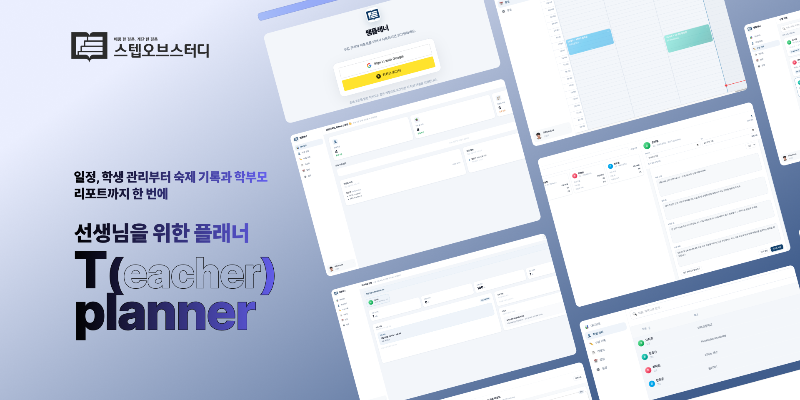

# Tplanner

**Deploy** https://tplanner.co.kr

한국어로 보기

## 소개

쌤플래너는 개인 과외 선생님을 위한 수업 관리 서비스입니다. 학생별 수업 일정, 기록, 숙제, 리포트를 한곳에서 관리할 수 있습니다.

개인 과외 수업은 학생마다 진도, 숙제, 이해도, 일정이 모두 다릅니다. 수업이 늘어날수록 지난 시간에 무엇을 했는지, 숙제를 냈는지, 다음 시간에 무엇을 이어가야 하는지 기억하고 정리하는 일이 부담이 됩니다. 쌤플래너는 이 흐름을 수업 단위로 정리해, 일정·기록·숙제·리포트가 자연스럽게 이어지는 과외 운영 경험을 만들어줍니다.

**이런 선생님께 어울립니다**

- 여러 학생의 수업 일정을 한눈에 관리하고 싶은 선생님
- 수업 후 기록을 꾸준히 남기고 다음 수업 준비에 활용하고 싶은 선생님
- 숙제와 이해도, 집중도 같은 수업 피드백을 학생별로 쌓아두고 싶은 선생님
- 학부모에게 전달할 수업 리포트를 더 쉽게 만들고 싶은 선생님

## 기술 스택

| 분류 | 기술 |
|------|------|
| Frontend | Next.js 14, React 18, TypeScript, Tailwind CSS |
| Backend | Prisma, PostgreSQL (Neon), NextAuth.js |
| Deploy | Vercel |

## 주요 기능

- **학생 관리**: 학생별 과목, 학년, 상태, 수업 통계를 관리합니다.
- **캘린더**: 월간, 주간, 일간 화면에서 수업 일정을 빠르게 확인하고 조정합니다.
- **수업 기록**: 수업 내용, 이해도, 집중도, 숙제 내용을 수업별로 남깁니다.
- **숙제 관리**: 수업에서 나온 숙제를 기록하고 완료 여부를 추적합니다.
- **리포트 작성**: 선택한 기간의 수업 기록을 바탕으로 학부모에게 공유할 리포트를 준비합니다.
- **학부모 화면**: 연결된 학생의 수업 기록과 리포트를 확인할 수 있습니다.

## 사용 방법

1. 학생을 등록합니다.
2. 캘린더에서 수업 일정을 추가합니다.
3. 수업 후 수업 기록과 숙제를 남깁니다.
4. 학생별 기록을 확인하며 다음 수업을 준비합니다.
5. 필요한 기간을 선택해 리포트를 작성합니다.

## 라이선스

[MIT License](LICENSE)

---

만든 이 이기훈 · [gl167@duke.edu](mailto:gl167@duke.edu)

## Introduction

Tplanner is a lesson management service for private tutors. It helps you manage lesson schedules, records, homework, and reports for each student in one place.

Every student has different progress, homework, comprehension, and schedules. As the number of students grows, it becomes increasingly difficult to remember what was covered last time, what homework was assigned, and what to continue next time. Tplanner organizes this flow by lesson, creating a seamless tutoring experience where schedule, records, homework, and reports naturally connect.

**Who it's for**

- Tutors who want to manage multiple students' schedules at a glance
- Tutors who want to keep consistent lesson notes and use them to prepare for the next session
- Tutors who want to track per-student feedback on homework, comprehension, and focus
- Tutors who want an easier way to create lesson reports to share with parents

## Tech Stack

| Category | Technology |
|----------|------------|
| Frontend | Next.js 14, React 18, TypeScript, Tailwind CSS |
| Backend | Prisma, PostgreSQL (Neon), NextAuth.js |
| Deploy | Vercel |

## Features

- **Student Management**: Manage subject, grade, status, and lesson statistics per student.
- **Calendar**: Quickly view and adjust lesson schedules in monthly, weekly, and daily views.
- **Lesson Records**: Log lesson content, comprehension, focus level, and homework by session.
- **Homework Tracking**: Record homework assigned in each lesson and track completion status.
- **Report Writing**: Prepare parent-shareable reports based on lesson records from a selected period.
- **Parent View**: Parents can check their student's lesson records and reports.

## How to Use

1. Register your students.
2. Add lesson schedules in the calendar.
3. After each lesson, log the lesson record and homework.
4. Review per-student records to prepare for the next lesson.
5. Select a time period and create a report.

## License

[MIT License](LICENSE)

---

Made by Gihun Lee · [gl167@duke.edu](mailto:gl167@duke.edu)
